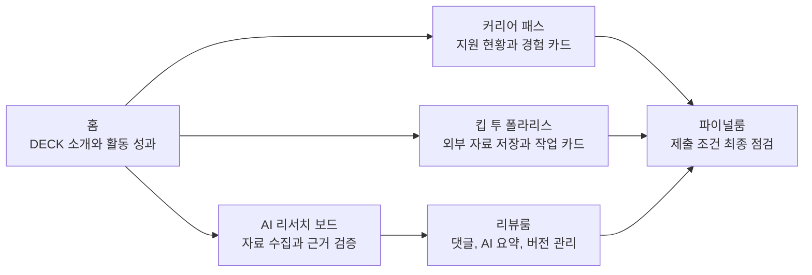
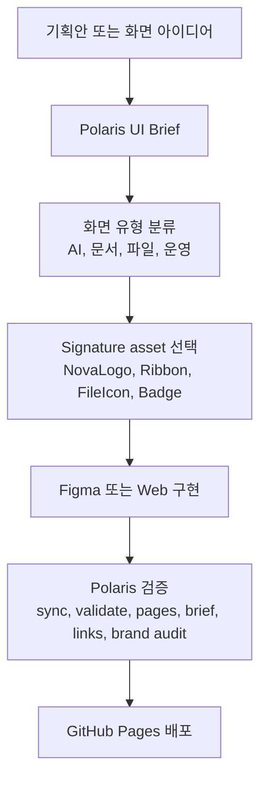
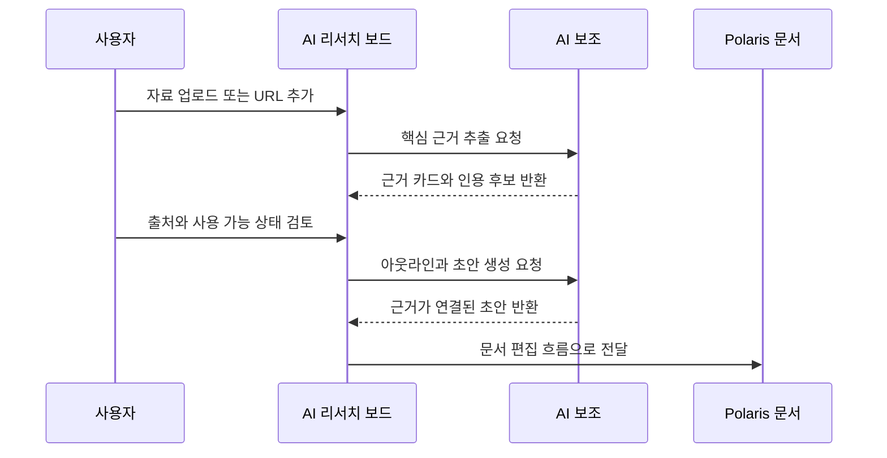

# DECK A팀 Polaris Workspace

Polaris Office 톤앤매너를 기준으로 DECK A팀의 기획안, 전략 흐름, 문서 작업 시나리오를 웹 UI로 빠르게 확장하기 위한 작업 공간입니다. 이 저장소의 핵심은 **DECK의 전략적 사고를 Polaris 문서 경험으로 옮기는 것**입니다.

## 기술 스택

| 영역 | 스택 |
| --- | --- |
| Frontend |    |
| Design System |   |
| Icons |  `@polaris/ui/icons` `@polaris/ui/ribbon-icons` `FileIcon` |
| Deploy |  |

## 핵심 전략

| 전략 축 | 의도 | Polaris 표현 | 현재 화면 |
| --- | --- | --- | --- |
| 전략 사고를 문서 산출물로 연결 | 리서치, 회의, 지원, 제출 흐름이 최종 문서로 이어지게 만듭니다. | 문서 캔버스, Ribbon, 파일 타입 신호 | AI 리서치 보드, 리뷰룸, 파이널룸 |
| AI는 업무 흐름의 보조 엔진으로 제한 | 생성 자체보다 근거 추출, 요약, 리뷰, 초안화를 돕습니다. | NOVA purple, AI CTA, `AiWriteIcon`, `AiChatIcon` | AI 리서치 보드, 리뷰룸 |
| 제출 리스크를 사전에 줄이기 | 파일명, 분량, 첨부 조건, 변경 내용 같은 마지막 단계 오류를 점검합니다. | `FileIcon`, Badge, Alert, 상태 아이콘 | 파이널룸 |
| 개인 성장 기록을 재사용 가능한 자산으로 전환 | 경험 카드와 지원 현황을 자소서 작성 재료로 축적합니다. | Card, Table, Badge, 편집 Ribbon | 커리어 패스 |
| 외부 자료를 Polaris 안의 작업 카드로 전환 | 저장한 파일을 목적, 할 일, 완료 기록으로 이어 붙입니다. | `FileIcon`, 작업 카드, 완료 기록 | 킵 투 폴라리스 |

## 제품 흐름



## 작업 방식



## 화면별 역할과 시각 신호

| 화면 | 사용자 목표 | 주요 흐름 | 아이콘/자산 |
| --- | --- | --- | --- |
| 홈 | DECK A팀의 방향과 활동 성과를 빠르게 이해 | 소개, 성과 지표, 주요 활동 진입 | `Home`, `PolarisLogo` |
| 커리어 패스 | 채용 공고와 경험 카드를 연결해 자소서 초안을 작성 | 지원 현황 -> 경험 카드 -> 문항별 초안 | `BriefcaseBusiness`, `Puzzle`, Ribbon |
| 파이널룸 | 최종 제출 파일의 조건 누락을 점검 | 파일 업로드 -> 제한 조건 입력 -> 제출 체크 | `FileSearch`, `Archive`, `FileIcon`, Badge |
| 킵 투 폴라리스 | 외부 문서를 저장하고 목적별 작업 카드로 전환 | 보관함 -> 목적 선택 -> 작업 카드 -> 완료 기록 | `Inbox`, `FolderInput`, `FileIcon` |
| 리뷰룸 | 문서 댓글과 AI 요약을 회의록, 버전 관리로 연결 | 댓글 확인 -> AI 요약 -> 버전 저장 -> 최종본 | Ribbon, `AiWriteIcon`, `AiChatIcon`, `WordCountIcon` |
| AI 리서치 보드 | 자료를 검증 가능한 근거 카드와 문서 초안으로 변환 | 자료 수집 -> 근거 추출 -> 출처 검증 -> 아웃라인 -> 초안 -> 문서 연동 | `Sparkles`, `ShieldCheck`, `FileIcon`, Ribbon |

## AI 리서치 보드 세부 흐름

| 단계 | 입력 | 처리 | 출력 |
| --- | --- | --- | --- |
| 자료 수집 | PDF, DOCX, HWP, URL, 인터뷰 전사 | 파일 타입과 출처를 함께 저장 | 자료 보관함 |
| 근거 추출 | 저장된 자료 | AI가 핵심 문장과 인용 후보를 분리 | 근거 카드 |
| 출처 검증 | 근거 카드 | 최신성, 출처 명확성, 사용 가능 여부 확인 | 검증 상태 Badge |
| 아웃라인 | 검증된 근거 | 주장과 근거를 문단 구조로 연결 | 발표/보고서 개요 |
| 초안 작성 | 아웃라인 | AI 초안을 생성하되 근거 연결을 유지 | 문서 초안 |
| 문서 연동 | 초안과 근거 | Polaris 문서 편집기로 이동 | 편집 가능한 산출물 |



## Polaris 원칙

| 원칙 | 적용 기준 |
| --- | --- |
| 토큰 우선 | 색상, 타이포그래피, radius, spacing, shadow는 Polaris 토큰과 컴포넌트를 먼저 사용합니다. |
| AI 맥락 제한 | NOVA purple과 AI CTA는 요약, 생성, 자동화, 분석 흐름에만 사용합니다. |
| 파일 색상 의미 유지 | DOCX/HWP, XLSX, PPTX, PDF 색상은 파일 타입 신호로만 사용합니다. |
| 상태는 색상만으로 전달하지 않기 | Badge, Alert, icon을 함께 사용해 완료, 경고, 오류, 정보를 구분합니다. |
| 일반 SaaS화 방지 | 화면마다 Ribbon, `FileIcon`, `NovaLogo`, Polaris neutral surface 같은 signature asset을 확인합니다. |

## 링크

- 배포: [https://maetelson.github.io/polaris/](https://maetelson.github.io/polaris/)
- 개발 문서: [docs/development.md](docs/development.md)
- Polaris UI 작업 규칙: [AGENTS.md](AGENTS.md)
- 디자인 토큰 기준: [DESIGN.md](DESIGN.md)
- 톤앤매너 계약: [docs/design/polaris-ui-contract.md](docs/design/polaris-ui-contract.md)
- Figma 산출물 기준: [docs/design/figma-output-contract.md](docs/design/figma-output-contract.md)

## 로컬 실행

```bash
npm install
npm run dev
```

프로덕션 빌드와 preview:

```bash
npm run build
npm run preview
```

## 검증 체크리스트

| 검증 | 명령 |
| --- | --- |
| PolarisDesign snapshot drift 확인 | `npm run polaris:sync -- --check` |
| 동기화 계약 검증 | `npm run polaris:validate` |
| GitHub Pages coverage 확인 | `npm run polaris:pages:check` |
| Polaris UI Brief 계약 확인 | `npm run polaris:brief:check` |
| Markdown 링크 확인 | `npm run polaris:links:check` |
| 브랜드 우회 검사 | `npm run polaris:brand-audit` |
| 프로덕션 빌드 | `npm run build` |
